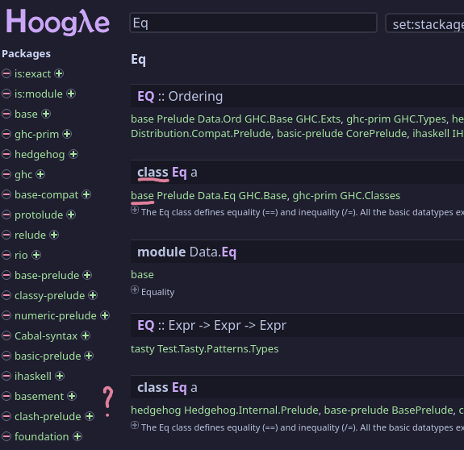
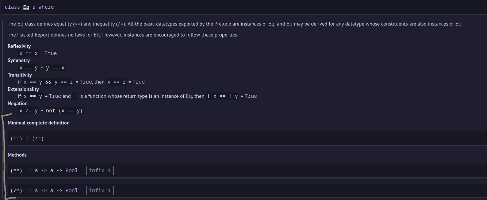

# DD1337 Week 3

## Reading recommendation

It's recommended that you read chapter 3 & 8 in the book [Learn You a Haskell](https://learnyouahaskell.github.io/).

## Cards

This week, we are going ahead a little bit to data structures to implement a type that represents a card, from a normal deck of cards. The goal is to define the type *and* enable behaviors through classes. You have full freedom about how they should work, so make it fun!

### Searching Hoogle

When you implement them, make sure you check what you need from [Hoogle](https://hoogle.haskell.org/), you can search the class name, and then you're looking for an entry that says `class <Name> <Type>` and that's inside the base package. For example:

The first option is correct, because it's in the base package, while the second option is incorrect, even though both are `class Eq a`.

Inside you're looking for the functions under "Minimal complete definition", again with the Eq example:

The `|` means or so you can pick one of them and you're done. The methods themselves are the patterns you have to implement.

### You should

* Create a type called "Card" that can be any of the 52 cards in a deck
* Implement the following classes **without** deriving them
  * Show: Don't just make it the type name itself, put a spin on it. Perhaps "4 of ♥"
  * Eq: So we can see if the cards are the same
  * Ord: Enables ordering the cards, this class needs Eq to be implemented already

### Optional challenges

* Implement more classes
  * Enum & Bounded: Then we can generate a whole deck very easily.
  * Read: Parse a string into your new type, the reverse of Show
  * Num: New number system??? base 10 😒 base card 😏
  * Find some other ones that seem interesting
* Use weird base types (for example Char for ranks or only using `newtype Card = Card Int`), can you figure out a super optimized type?
* Make your own class and apply it to your type

Good luck!
